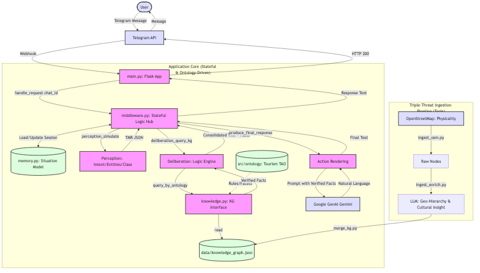

# Zero-Hallucination Tourism Concierge

A stateful, ontology-driven Telegram bot deployed on Google Cloud Run. It uses a formal cognitive architecture to provide verified tourism information for Singapore, ensuring zero-hallucination by grounding LLM responses in a Faceted Knowledge Graph.

## 🧠 Cognitive Architecture


The agent follows a multi-stage stateful pipeline:
1.  **Perception**: Extracts a Text Meaning Representation (TMR) including intent, ontology classes, and entities.
2.  **Memory (Situation Model)**: Persists and accumulates user state across turns (keyed by `chat_id`).
3.  **Symbolic Deliberation**: Performs ontology-driven queries against the Knowledge Graph.
4.  **Action Rendering**: Uses Gemini to translate verified facts into fluent, professional natural language.

## 🛠 Triple-Threat Ingestion Pipeline
The Knowledge Graph is populated via a specialized pipeline:
- **Physicality (OSM)**: Real-time node fetching from OpenStreetMap.
- **Geo-Hierarchy (LLM/OneMap)**: Automated resolution of raw coordinates into official Planning Areas.
- **Cultural Insight (LLM)**: Distillation of historical and cultural context for every establishment.

## 🚀 Setup & Deployment
Environment variables:
- `TELEGRAM_BOT_TOKEN` (required) - your Telegram bot token
- `GOOGLE_API_KEY` - Gemini API key
- `USE_TMR` (optional) - set to `true` for LLM-based perception

Build and run locally:
```bash
docker build -t tourism-concierge .
docker run -p 8080:8080 --env-file .env tourism-concierge
```

Deploy to Google Cloud Run (example):

```bash
# build and push an image (using gcloud)
gcloud builds submit --tag gcr.io/$(gcloud config get-value project)/telegram-gemini

# deploy to Cloud Run
gcloud run deploy telegram-gemini \
  --image gcr.io/$(gcloud config get-value project)/telegram-gemini \
  --region=us-central1 \
  --platform=managed \
  --allow-unauthenticated \
  --set-env-vars TELEGRAM_BOT_TOKEN=your_token,GOOGLE_API_KEY=your_key
```

After deployment, set your Telegram bot webhook to the Cloud Run URL (replace URL):

```bash
curl -X POST "https://api.telegram.org/bot$TELEGRAM_BOT_TOKEN/setWebhook" \
  -d "url=https://YOUR_CLOUD_RUN_URL/webhook"
```
